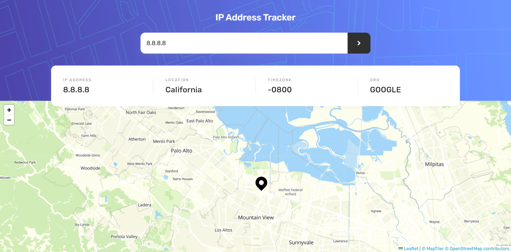

# Frontend Mentor - IP address tracker solution

This is a solution to the [IP address tracker challenge on Frontend Mentor](https://www.frontendmentor.io/challenges/ip-address-tracker-I8-0yYAH0). Frontend Mentor challenges help you improve your coding skills by building realistic projects.

## Table of contents

- [Overview](#overview)
  - [The challenge](#the-challenge)
  - [Screenshot](#screenshot)
  - [Links](#links)
- [My process](#my-process)
  - [Built with](#built-with)
  - [Useful resources](#useful-resources)
- [Author](#author)

## Overview

### The challenge

Users should be able to:

- View the optimal layout for each page depending on their device's screen size
- See hover states for all interactive elements on the page
- See their own IP address on the map on the initial page load
- Search for any IP addresses or domains and see the key information and location

### Screenshot

### Links

- Solution URL: [Add solution URL here](https://github.com/awsmPuff/ip-address-tracker)
- Live Site URL: [Add live site URL here](https://laurenxx-ip-address-tracker.netlify.app/)

## My process

### Built with

- Semantic HTML5 markup
- Flexbox
- SASS
- Mobile-first workflow
- [React](https://reactjs.org/) - JS library

### Useful resources

- [IP API](https://ipapi.co/) - Get timezone, region, lat, lon, langs, etc by ip address. 1000/day & 30000/month free
- [Leaflet](https://leafletjs.com/) - Generate map
- [React Leaflet](https://react-leaflet.js.org/) - React components for Leaflet maps
- [maptiler](https://www.maptiler.com/) - Provide map model

## Author

- Website - [Wanxia Xie/Laurenxx](https://www.your-site.com)
- Frontend Mentor - [@awsmPuff](https://www.frontendmentor.io/profile/awsmPuff)
